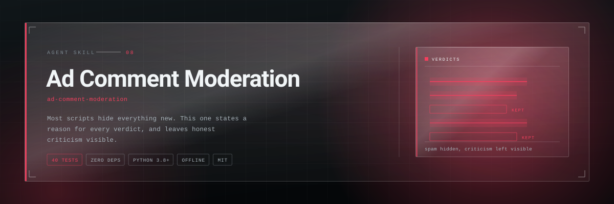
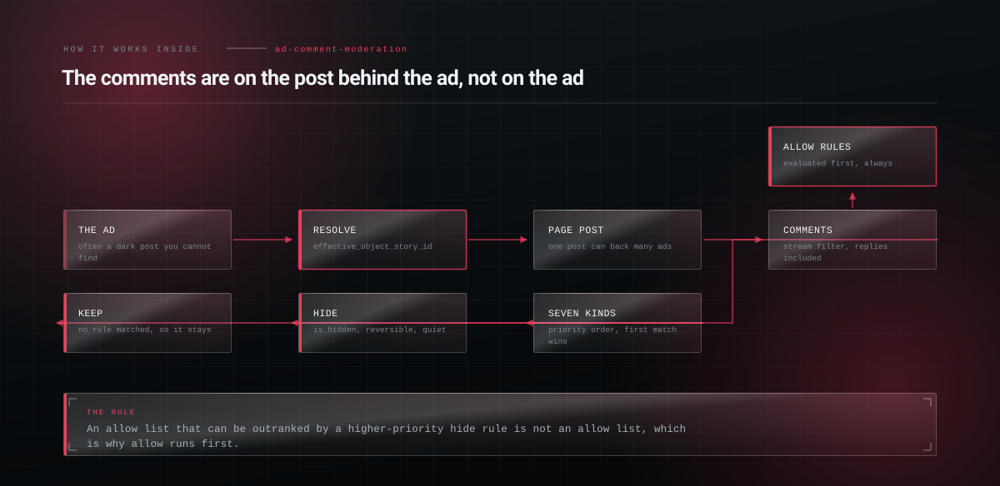

<p align="center">
  <picture>
    <source media="(prefers-color-scheme: dark)" srcset="assets/hero-dark.svg">
    <source media="(prefers-color-scheme: light)" srcset="assets/hero-light.svg">
    
  </picture>
</p>

<h1 align="center">Ad Comment Moderation</h1>

<p align="center"><b>Moderate the comments under your Facebook and Instagram ads with a rule engine that states a reason for every verdict, keeps honest criticism visible, and resolves where the comments on a dark post actually live.</b></p>

<p align="center">
<a href="LICENSE"></a>
  
  
  
  
</p>

<p align="center">
  <code>npx skills add Hiberius/ad-comment-moderation</code>
</p>

<p align="center">
  <sub>Works with Claude Code, Claude Desktop, Codex, Cursor, Windsurf, OpenClaw and
  anything else that reads a <code>SKILL.md</code>.</sub>
</p>

---


## It decides, it does not just delete

Most "hide Facebook comments" scripts hide everything new. That buries genuine questions
and honest criticism along with the spam, which is why the category has the reputation it
has.

Under a lead-gen ad this is not cosmetic. Link drops send your paid traffic to a
competitor, scam replies impersonate you to people who just gave you their number, and
both sit under the ad for as long as it runs.

## What it does

| Command | What you get |
|---|---|
| `test` | A dry run over one comment or a CSV of them, with the deciding rule and its reason |
| `rules` | The starter rule set as JSON, ready to edit |
| `explain` | Every rule that ran, in order, and why each one did or did not match |

Seven rule kinds — `keyword`, `regex`, `link`, `contact`, `emoji_spam`, `min_length`,
`author_allow` — each with an action (`hide`, `flag`, `allow`) and a priority.


## How it works inside

<p align="center">
  <picture>
    <source media="(prefers-color-scheme: dark)" srcset="assets/diagram-dark.svg">
    <source media="(prefers-color-scheme: light)" srcset="assets/diagram-light.svg">
    
  </picture>
</p>


## Every verdict states a reason

```bash
python3 scripts/modrules.py test comments.csv
```
```
WOULD HIDE             Buy cheap followers at crypto-x(dot)com now
                       Links: contains an obfuscated link: 'crypto-x(dot)com'
WOULD HIDE             🔥🔥🔥🔥🔥🔥🔥
                       Emoji flooding: carries 7 emoji, threshold 6
WOULD HIDE             check my profile
                       Known spam and scam phrases: matched the term 'check my profile'
WOULD KEEP             Honestly the last bag was stale and shipping took nine days.
WOULD KEEP             Servizio PESSIMO non comprate qui

10 comment(s): 6 would be hidden, 4 kept
This is a dry run. Nothing was sent anywhere.
```

The two complaints stay visible. No rule matches them, and a moderation tool has no
business hiding a comment it cannot give a reason for.

## Where ad comments actually live

The thing that stops most people before they start: a comment on your ad is attached to
the **page post** behind the creative, not to the ad. For a dark post, that post exists,
is reachable, and never appears on your page.

```
ad ──► adcreative ──► effective_object_story_id ──► "{page_id}_{post_id}" ──► /{post_id}/comments
```

One post often backs many ads, so you moderate the post, not the ad. Instagram comments on
the same creative are a separate thread reached through the Instagram media id.

## Allow rules run first, always

An allow list that can be outranked by a higher-priority hide rule is not an allow list.
This ordering is why a customer cannot be hidden by a rule someone added in a hurry.

## Dry run, then flag, then hide

`flag` records a verdict and writes nothing anywhere. Add every new rule as `flag`, let it
run for a day on real comments, read what it caught, and only then switch it to `hide`.
Skipping that is how a moderation tool hides its first customer.

## A working implementation

[CommentHide](https://github.com/Hiberius/commenthide-facebook-comment-moderation) is the
full thing: a single Cloudflare Worker with D1, a dashboard, a dry-run inspector and
one-click undo, MIT. This skill is the reasoning behind it, usable on any stack.


## Documentation

- [`SKILL.md`](SKILL.md) — the skill itself, what the agent reads
- [`references/rule-design.md`](references/rule-design.md) — the seven kinds, ordering, tuning for lead gen, competitor poaching, false positive discipline
- [`references/meta-graph-comments.md`](references/meta-graph-comments.md) — dark posts, hide against delete, pagination, rate limits, token handling


## Related skills

- **[whatsapp-receptionist-builder](https://github.com/Hiberius/whatsapp-receptionist-builder)** — the other side of a Meta presence: the conversation
- **[invisible-text-forensics](https://github.com/Hiberius/invisible-text-forensics)** — what can be hidden inside a comment you feed to a model
- **[cpa-profit-ops](https://github.com/Hiberius/cpa-profit-ops)** — the campaigns whose comments these are

All ten in one install:

```
/plugin marketplace add Hiberius/hiberius-skills
```


## Work with me

I build the systems these skills came out of: performance marketing infrastructure,
lead pipelines, ad account tooling, internal automation, and products on the Cloudflare
edge stack. If you need something like this built properly, I take on freelance and
contract work.

**[Christian Calabro — github.com/Hiberius](https://github.com/Hiberius)**

Performance marketing · media buying · TypeScript · Cloudflare Workers · Next.js · Python

---

## Contributing

Issues and pull requests welcome. The rule for a change to the skill itself: it has to
be something you learned by getting it wrong once, not something you read in the docs.

## License

MIT. No network calls, no telemetry, no dependencies.
